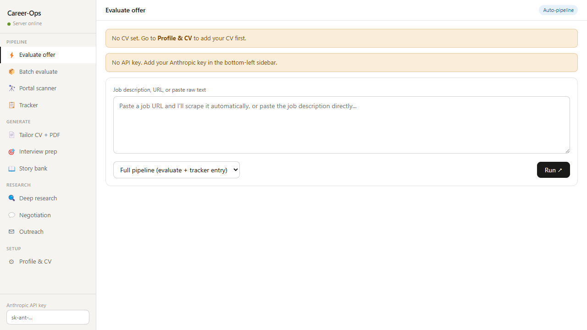

# Career-Ops

Local AI job-search workstation for evaluating roles, tailoring resumes, generating interview prep, and tracking applications in one browser app.



## What This App Does

Career-Ops combines a single-page frontend with a lightweight Node.js backend so you can run an end-to-end job search workflow locally:

- Evaluate job postings with a structured A-F scoring framework
- Scrape job descriptions from URLs with Playwright
- Batch-process multiple roles in one pass
- Scan saved company career portals for openings
- Tailor a CV to a specific job description and export it to PDF
- Generate interview prep, story bank material, negotiation notes, and outreach drafts
- Track applications locally and export the tracker as TSV

## Codebase Overview

This repo is intentionally small and direct:

- `index.html` contains the full frontend app, including UI, prompts, local state management, and workflow logic
- `server.js` runs an Express server that serves the app and provides local backend endpoints
- `setup.sh` installs dependencies and Playwright Chromium
- `package.json` defines the minimal Node.js runtime and dependencies

## How It Works

The backend exposes a few focused endpoints:

- `/api/claude` proxies Anthropic API requests to avoid browser CORS issues
- `/api/scrape` opens a job post in Playwright, extracts useful content, and flags likely closed listings
- `/api/scan` visits saved career pages and collects job links
- `/api/pdf` renders the generated CV preview into a downloadable PDF
- `/api/health` is used by the UI to detect whether the local server is online

Most user data stays in browser `localStorage`, including profile details, CV text, tracker entries, saved portals, and the API key. The main network traffic is to Anthropic when you run AI workflows and to job pages when Playwright scrapes them.

## Stack

- Node.js
- Express
- Playwright
- Plain HTML, CSS, and JavaScript
- Anthropic Messages API

## Setup

Requirements:

- Node.js 18+
- An Anthropic API key

Install dependencies:

```bash
npm install
npx playwright install chromium
```

Or use the helper script:

```bash
bash setup.sh
```

## Run Locally

```bash
node server.js
```

Then open `http://localhost:3747`.

## Notes For GitHub

- `node_modules/` is ignored and should not be committed
- The screenshot used in this README lives at `assets/career-ops-screenshot.png`
- This repo is best presented as a local productivity app rather than a deploy-to-cloud service
